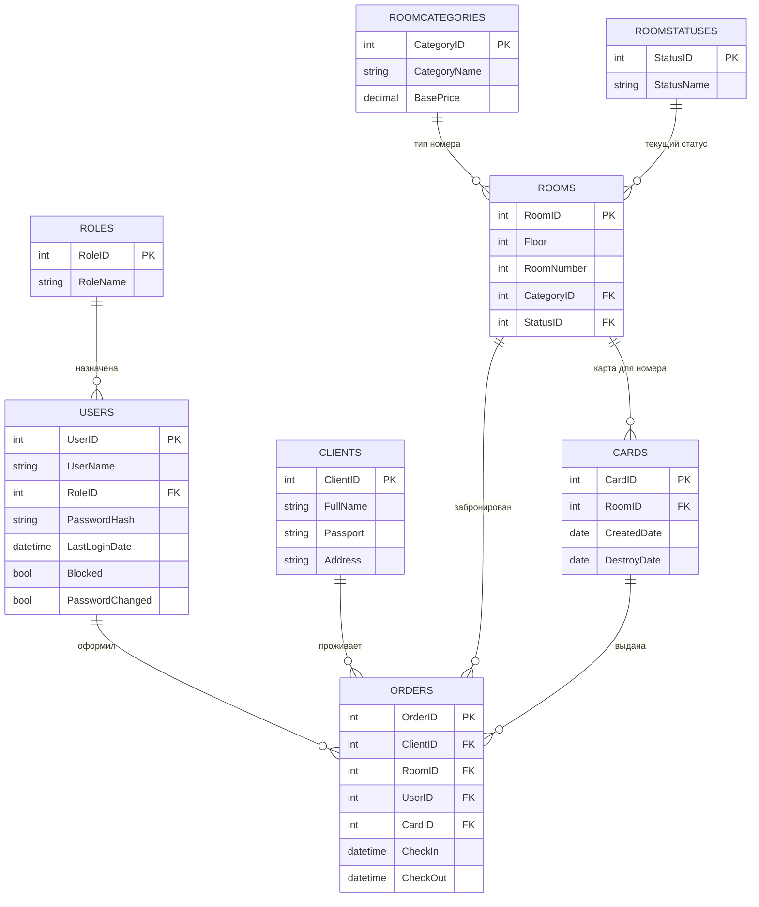

# Модуль 1. ER-диаграмма гостиницы Alpha (3НФ)

## Откуда взялись сущности

Из брифинга заказчика и из реальных файлов в `Документы заказчика.zip`:

- **Номерной фонд.xlsx** → поля `Этаж`, `Номер`, `Категория` — это сущность **Номер (Room)**.
- **Отчет по состоянию номерного фонда на дату.xlsx** → у номера есть статус
  (`Занят`, `Чистый`, `Грязный`, `Назначен к уборке` — и, по брифингу, ещё `Свободен`)
  и дата выезда — это журнал заселений, т.е. сущность **Бронирование/Проживание (Order)**.
- **Постояльцы живущие сейчас в гостинице.xlsx** → ФИО клиента, даты въезда/выезда,
  привязка к номеру — тоже данные сущности **Order**, а ФИО — сущность **Клиент (Client)**.
- Брифинг: "активирует карту доступа к номеру" → сущность **Карта доступа (Card)**.
- Брифинг: "администратор", "руководитель" работают в системе → сущности
  **Пользователь (User)** и **Роль (Role)** (нужны и для Модуля 3 — форма авторизации).

## Почему это 3НФ

- Каждая таблица описывает **одну** сущность, в ней нет данных о других сущностях
  "вперемешку" (например, в `Orders` нет ни ФИО клиента, ни названия номера — только
  ссылки `ClientID`, `RoomID`).
- **Категория номера** и **Статус номера** вынесены в отдельные справочники
  (`RoomCategories`, `RoomStatuses`), а не хранятся текстом в каждой строке `Rooms`.
  Если хранить текстом — при переименовании категории пришлось бы менять текст
  во всех номерах этой категории разом (аномалия обновления, нарушение 2НФ/3НФ по духу
  нормализации словарных значений).
- Нет не-ключевых атрибутов, зависящих от других не-ключевых атрибутов (транзитивных
  зависимостей): например, `Price` зависит только от `RoomID` (через `CategoryID` цена
  не "наследуется" неявно — если нужно хранить цену по категории, она хранится в
  `RoomCategories.BasePrice`, а не дублируется в каждой строке `Rooms`).

## Сущности и атрибуты

```
Roles(RoleID PK, RoleName)
Users(UserID PK, UserName, RoleID FK→Roles, PasswordHash, LastLoginDate, Blocked, PasswordChanged)
Clients(ClientID PK, FullName, Passport, Address)
RoomCategories(CategoryID PK, CategoryName, BasePrice)
RoomStatuses(StatusID PK, StatusName)        -- Свободен/Занят/Грязный/Назначен к уборке/Чистый
Rooms(RoomID PK, Floor, RoomNumber, CategoryID FK→RoomCategories, StatusID FK→RoomStatuses)
Cards(CardID PK, RoomID FK→Rooms, CreatedDate, DestroyDate)
Orders(OrderID PK, ClientID FK→Clients, RoomID FK→Rooms, UserID FK→Users, CardID FK→Cards,
       CheckIn, CheckOut)
```

## Готовые файлы для сдачи

- **`01_ER-diagram.pdf`** — готовый `.pdf` с таблицами, атрибутами, PK/FK и связями 1:N,
  то есть именно то, что требует текст Модуля 1 дословно ("ER-диаграмма должна быть
  представлена в формате .pdf и содержать таблицы, связи между ними, атрибуты и ключи").
  MS Visio в тексте задания вообще не упомянут — это требование нужно только для PDF.
- **`01_ER-diagram.vsdx`** — та же схема как настоящий файл MS Visio, на случай если
  хочешь открыть/доработать её именно в Visio, а потом экспортировать в pdf сам.
  Как он сделан: у меня нет лицензии/доступа к самому Visio на этой машине, поэтому
  файл собран программно (Python, библиотека `vsdx`, из официального формата .vsdx —
  это обычный zip с XML, как .docx/.xlsx). По пути нашёл и исправил баг в самой
  библиотеке (она некорректно расставляла XML-префиксы в нескольких служебных файлах,
  из-за чего получившийся файл открывался пустым). Проверить в настоящем Visio я не
  могу (его тут нет), поэтому независимо проверил по-другому: открыл файл в LibreOffice
  (у него есть свой отдельный, несвязанный с vsdx-библиотекой, импорт формата Visio) —
  после исправления бага диаграмма открывается и выглядит правильно (все 8 таблиц,
  атрибуты, PK/FK, связи). Это сильный, но не 100% гарантированный сигнал, что и в
  реальном MS Visio файл откроется нормально — **на всякий случай открой его в Visio
  заранее, не в день экзамена**, и если вдруг он не откроется (например, попросит
  "восстановить" файл) — у тебя уже есть полностью рабочий и самодостаточный
  `01_ER-diagram.pdf`, который сам по себе полностью закрывает требование задания.

## Диаграмма (Mermaid, для справки)

Это даёт наглядную картинку прямо в любом Markdown-превью с поддержкой Mermaid
(VS Code, GitHub, Obsidian) — содержимое идентично `01_ER-diagram.pdf`.



## Жизненный цикл статуса номера (из брифинга — пригодится устно объяснить эксперту)

```
Свободен → (заселение) → Занят → (выезд, 12:00) → Грязный
  → (назначена уборка) → Назначен к уборке → (уборка выполнена) → Чистый → Свободен
```
Заселить гостя можно только в номер со статусом «Чистый»/«Свободен» — это бизнес-правило,
а не ограничение БД, проверяется на уровне приложения/запроса.
